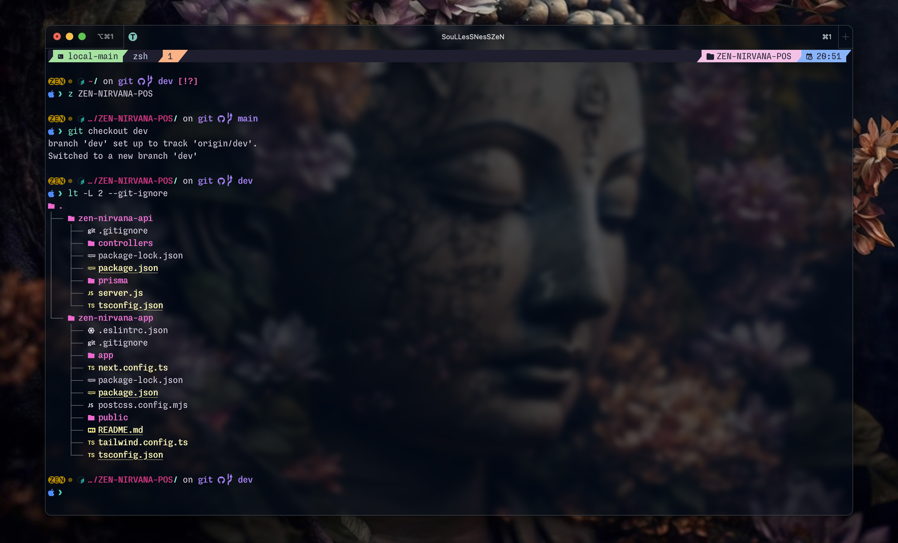
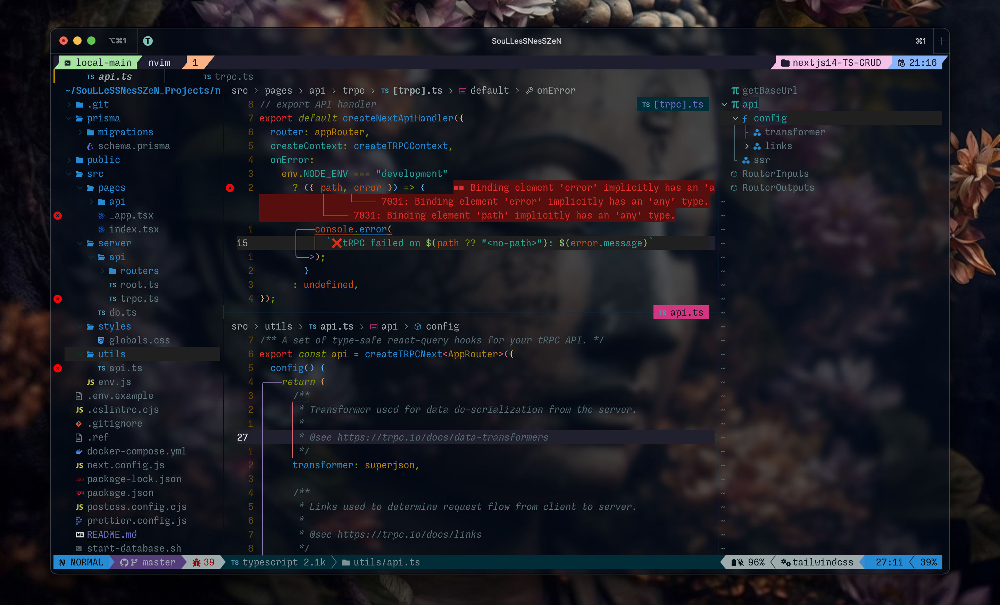
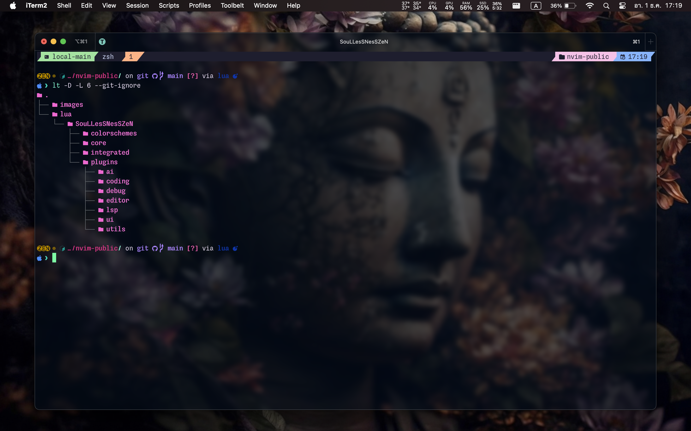

# SouLLesSNesSZeN's Nvim config (public)
This is my Neovim configuration repository.
(These configs migrated from packer to lazyvim)
## ScreenShot




## Files Structure

## Requirements
- Neovim >= 0.9.0
- Git >= 2.29.0
- LazyGit
- LazyVim
- ripgrep
- fd
- fzf
## Terminal and Shell
- iTerm2
- Alacritty
- bash
- zsh
- fish
- nu
- Neovide (UI Integrated with Neovim)
## Installations
```zsh
git clone --recursive https://github.com/soullessness1611/nvim-public.git ~/.config/ && \
	mv ~/.config/nvim-public ~/.config/nvim
```
## Components list
- Colorschemes
	- Catppuccin
	- Solarized-osaka
- Integrated
	- Neovide
- Plugins
	- ai
		- Copilot
	- coding
		- action-preview
		- code-runner
		- codesnap
		- colorizer
		- colortils
		- document-color
		- null-ls
		- nvim-cmp
		- nvim-treesitter
		- quick-code-runner
		- tailwindcss-solorizer-cmp
		- TreeSJ
	- Debug
		- nvim-dap-ui
		- nvim-dap-virtual-text
	- Editor
		- autopairs
		- comment
		- format-on-save
		- git-conflict
		- hop
		- incRename
		- moveline
		- nvim-surround.lua
		- reactive.lua
		- telescope.lua
		- todo-comment.lua
		- ufo.lua
	- LSP
		- lsp-config
		- mason
		- lspsaga
	- UI
		- barbecue
		- bufferline
		- hlchunk
		- incline
		- indent-blankline
		- lualine
		- neo-tree
		- noice
		- nvim-tree
		- outline
		- which-key
		- zen
		- twilight
	- Utilities
		- bracey
		- cellular-automaton
		- diffview
		- git
		- goto-preview
		- live-server
		- markdown-preview
		- ssr
		- searchbox
		- surround
		- wakatime