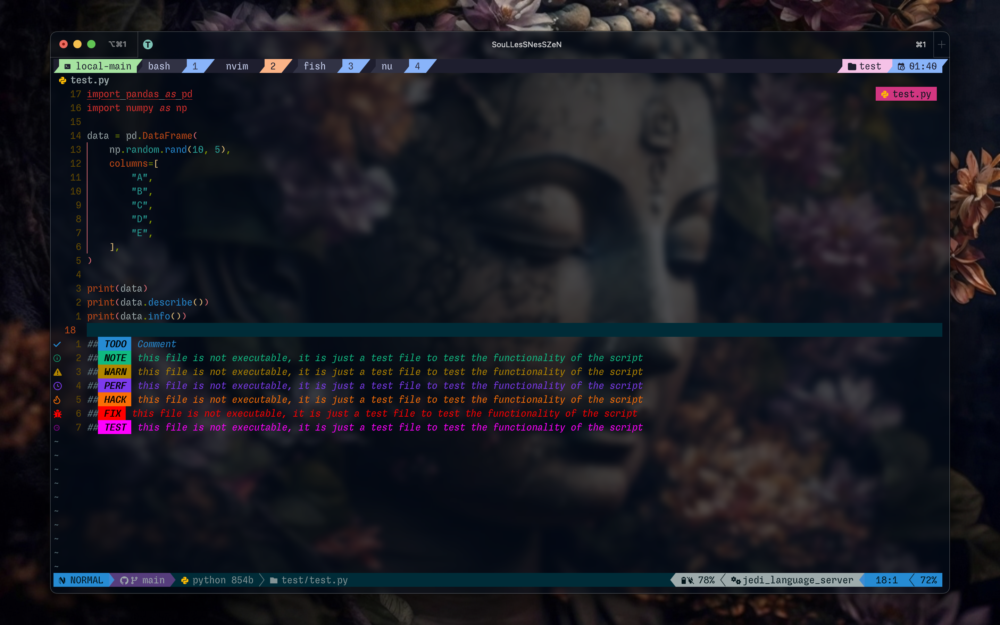

# SouLLesSNesSZeN's Nvim config (public)
This is my Neovim configuration repository.
(These configs migrated from packer to lazyvim)

## Screenshot
<table width="100%">
  <tr>
  </tr>
  <tr>
    <td width="50%">
      
    </td>
    <td width="50%">
      
    </td>
  </tr>
  <tr>
  </tr>
  <tr>
    <td width="50%">
      
    </td>
    <td width="50%">
      
    </td>
  </tr>
</table>

## Files Structure

## Requirements
- Neovim
- Git
- LazyGit
- LazyVim
- ripgrep
- fd
- fzf
## Terminal and Shell
- iTerm2
- bash
- zsh
- fish
- nu
- Neovide (UI Integrated with Neovim)
## Installations
```zsh
cd ~/.config/
git clone --recursive https://github.com/soullessness1611/nvim-public.git && \
	mv ~/.config/nvim-public ~/.config/nvim

nvim
```
## Components list
- Colorschemes
	- solarized-osaka
- Integrated
	- Neovide
- Plugins
	- ai
		- copilot
		
	- coding
		- action-preview
		
		- code-runner
		
		- codesnap
		
		- colorizer
		
		- colortils
		
		- document-color
		- null-ls
		- nvim-cmp
		
		- nvim-treesitter
		
		- quick-code-runner
		
		- tailwindcss-solorizer-cmp
		- TreeSJ
	- Debug
		- nvim-dap-ui
		- nvim-dap-virtual-text
	- Editor
		- autopairs
		- comment
		- format-on-save
		- git-conflict
		- hop
		
		- incRename
		
		- moveline
		- nvim-surround
		- reactive
		- telescope
		
		- todo-comment
		
		- ufo.lua
		
	- LSP
		- lsp-config
		- mason
		- lspsaga
	- UI
		- barbecue
		- bufferline
		- hlchunk
		- incline
		- indent-blankline
		- lualine
		- neo-tree
		- noice
		- nvim-tree
		- outline
		- which-key
		- zen
		- twilight
	- Utilities
		- bracey
		- cellular-automaton
		- diffview
		- git
		- goto-preview
		- live-server
		- markdown-preview
		- ssr
		- searchbox
		- wakatime